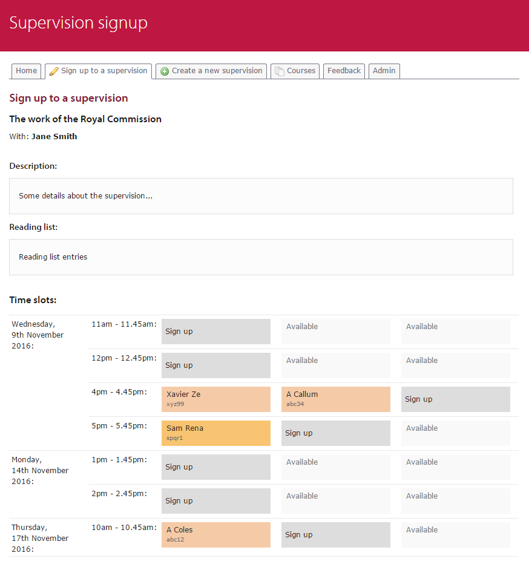

Supervision signup system
=========================

This is a PHP application which implements a simple supervision signup system.

Screenshot
----------

Usage
-----

1. Clone the repository.
2. Download the library dependencies and ensure they are in your PHP include_path.
3. Download and install the famfamfam icon set in /images/icons/
4. Add the Apache directives in httpd.conf (and restart the webserver) as per the example given in .httpd.conf.extract.txt; the example assumes mod_macro but this can be easily removed.
5. Create a copy of the index.html.template file as index.html, and fill in the parameters.
6. Access the page in a browser at a URL which is served by the webserver.

Dependencies
------------

* [FamFamFam Silk Icons set](http://www.famfamfam.com/lab/icons/silk/)

Author
------

Martin Lucas-Smith, Department of Geography, 2016-24.

License
-------

GPL3.

